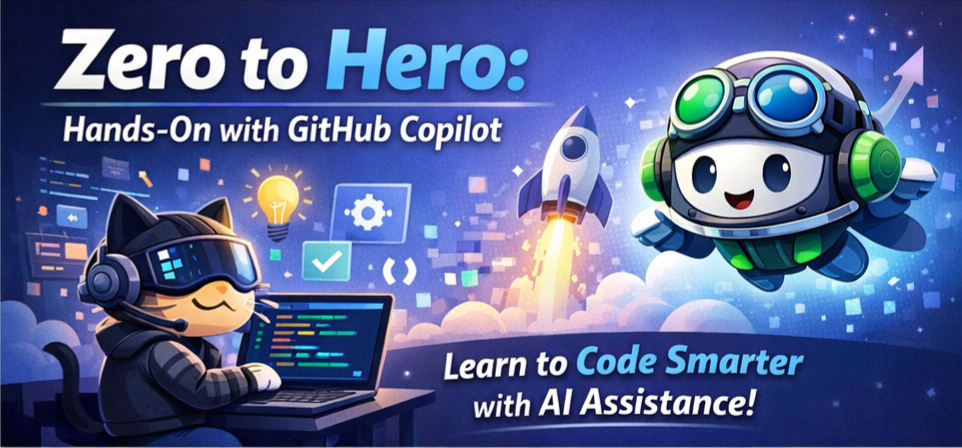

# Zero to Hero: Hands-On with GitHub Copilot 

## Delivery Bill of Materials

**Lab:** Zero to Hero: Hands-On with GitHub Copilot  
**Duration:** ~90 minutes (1 hour of lab + 30 minutes for intro, wrap-up, and buffer)  
**Audience:** Developers, engineering leads, and technical decision makers  

This document provides everything needed to deliver this lab for a hands-on learning session.
---

## Table of Contents

- [Lab Summary](#lab-summary)
- [Customer Prerequisites](#customer-prerequisites)
- [Seller Preparation Checklist](#seller-preparation-checklist)
- [Delivery Agenda & Pacing Guide](#delivery-agenda--pacing-guide)
- [Delivery Guide by Exercise](#delivery-guide-by-exercise)
- [Email Templates](#email-templates)
  - [Pre-Training Invite](#pre-training-invite-email)
  - [Reminder (Day Before)](#reminder-email-day-before)
  - [Post-Training Follow-Up](#post-training-follow-up-email)
- [Frequently Asked Questions](#frequently-asked-questions)

---

## Lab Summary

Participants work through the **Octocat Supply** e-commerce application to experience GitHub Copilot across the full software development lifecycle:

| Exercise | Duration | What Participants Do | Key Value Message |
|----------|----------|----------------------|-------------------|
| **Getting Started** | 5 min | Create repo from template, install dependencies, verify Copilot | Fast onboarding — start coding in minutes |
| **Exercise 1: Copilot Basics** | 10 min | Code completions, Copilot Chat, modes & models | Inline AI boosts everyday coding speed |
| **Exercise 2: Agent Mode** | 15 min | Plan mode, agent mode, vision, review workflow | Implement multi-file features from a description + image |
| **Exercise 3: Agentic AI** | 20 min | Coding Agent, Code Review, AI Autofix | AI across the entire SDLC — plan, code, review, secure |
| **What's Next** | 10 min | Custom instructions, agents, MCP, memory, spaces | Copilot can be customized and extended to meet your organization's needs |

---

## Customer Prerequisites

Share these requirements with attendees **at least one week before** the session.

### Accounts & Licenses

| Requirement | Details |
|-------------|---------|
| **GitHub account** | Free account at [github.com/signup](https://github.com/signup). Must be able to log in during the session. |
| **GitHub Copilot license** | One of: **Copilot Pro**, **Copilot Pro+**, **Copilot Business**, or **Copilot Enterprise**. A [free trial of Copilot Pro](https://github.com/settings/copilot) works if the customer does not yet have a license. |
| **Network access to GitHub.com** | Ensure the customer environment (corporate network, VPN, etc.) allows access to **github.com** and related domains. GitHub Copilot requires an internet connection. |

### Software (Local Development)

| Software | Version | Notes |
|----------|---------|-------|
| **Visual Studio Code** | Latest stable | [Download](https://code.visualstudio.com/). **VS Code Insiders** also works fine. |
| **Node.js** | v18+ | [Download](https://nodejs.org/) — required for `npm` |
| **Git** | Latest | [Download](https://git-scm.com/) |
| **Make** | Any | Pre-installed on macOS/Linux. Windows users: install via [chocolatey](https://chocolatey.org/) (`choco install make`) or use Git Bash. |

### Alternative: GitHub Codespaces (Recommended for Simplicity)

If attendees cannot install local tooling, they can use **GitHub Codespaces** — a cloud-based dev environment that has all prerequisites pre-installed:

1. Navigate to their repository on GitHub.com (created from the template)
2. Click **Code** → **Codespaces** → **Create codespace on main**
3. Wait for the environment to build (1–2 minutes)
4. Everything (VS Code, Node.js, Git, Make, Copilot) is ready to use

> **Seller tip:** Codespaces is the safest option for large groups where you can't control attendee machine configurations. Ensure the customer's GitHub plan includes Codespaces minutes or they are using a personal account (free tier includes 60 hours/month).

### Lab Environment

We prefer running this lab inside the **customer's own GitHub environment** so attendees experience Copilot in a setting that reflects their day-to-day work. However, if the customer's environment cannot meet the prerequisites (licensing, policies, network access, etc.), **we can supply a pre-configured lab environment**. See instructions at: [https://aka.ms/golden-ticket](https://aka.ms/golden-ticket).

### Copilot Organization / Enterprise Policy Requirements

For customers on **Copilot Business** or **Copilot Enterprise**, an org or enterprise admin must enable the following features in their Copilot policy settings. Without these, key exercises will not work. Work with the customer's admin **well before** the session to confirm these are turned on.

<!-- TODO get these all updated  -->

| Policy / Feature | Required For | Where to Enable |
|------------------|-------------|-----------------|
| **Copilot Chat in the IDE** | Exercises 1 & 2 | Org/Enterprise Copilot settings |
| **Copilot Agent Mode in IDE Chat** | Exercise 2 | Org/Enterprise Copilot settings |
| **Copilot in GitHub.com** | Exercise 2 | Org/Enterprise Copilot settings |
| **Copilot Coding Agent** | Exercise 3 — assigning issues to Copilot | Org/Enterprise Copilot policy settings → "Coding agent" |
| **Copilot Code Review** | Exercise 3 — requesting AI code reviews on PRs | Org/Enterprise Copilot policy settings → "Code review" |
| **Editor preview features** | Agent Mode, Plan Mode, vision capabilities | Org/Enterprise Copilot policy settings → "Editor preview features" |
| **GitHub Actions** | Exercise 3 — Coding Agent runs as a GitHub Actions workflow | Org/Enterprise settings → Actions → "Allow all actions" or equivalent |

> **How to check:** Go to **Organization settings** → **Copilot** → **Policies** (or **Enterprise settings** → **AI Controls**) and confirm each feature is set to **Enabled**. See [Managing Copilot policies](https://docs.github.com/copilot/concepts/policies) for details.

<!-- double check this -->

> **For Copilot Pro / Pro+ users:** These features are enabled by default at the individual level — no admin action needed.

<!-- do you really need pro+? -->

> **Important:** Exercise 3 (Coding Agent) requires **Copilot Pro+**, **Copilot Business**, or **Copilot Enterprise**. This exercise is the biggest "wow moment" and should always be included — confirm the plan supports it before the session.

> **EMU enterprises:** Copilot Coding Agent cannot run in user-namespace repositories within an EMU (Enterprise Managed Users) enterprise. Participants must create their repos within an organization instead.

---

## Seller Preparation Checklist

Complete these steps **before** the training session.

### 1–2 Weeks Before

- [ ] Confirm attendee list and send **pre-training invite email** (template below)
- [ ] Verify attendees have GitHub accounts and Copilot licenses
- [ ] Confirm attendees' Copilot plan supports Coding Agent for Exercise 3 (Pro+, Business, or Enterprise)
- [ ] Verify attendees can reach github.com from their corporate environment
- [ ] Decide: local development or Codespaces? Adjust prerequisites in communications accordingly

### 1–2 Days Before

- [ ] Send **reminder email** (template below)
- [ ] Run through the entire lab yourself end-to-end to verify template repo and content
- [ ] Create a repo from the template into a personal test account and complete all exercises
- [ ] Prepare a screen-share–ready VS Code window with the lab repo open
- [ ] Download/review the **[intro/closing slide deck](TODO: ADD DECK LINK)** and customize with customer name/context
- [ ] Pre-load browser tabs: GitHub repo, GitHub Issues, Pull Requests
- [ ] Test your video/audio/screen-sharing setup
- [ ] Have the lab markdown files open (or the combined.md) for reference
- [ ] Have a pre-completed Coding Agent PR ready as a backup demo (in case the agent takes too long live)

### Day Of

- [ ] Join the meeting 10 minutes early
- [ ] Have attendees confirm they can access GitHub.com and have Copilot active
- [ ] Keep a terminal with the running application nearby for demos
- [ ] Have the **Troubleshooting Guide** below ready for quick reference

---

## Delivery Agenda & Pacing Guide

Below is the recommended agenda for a **90-minute** session. The extra time beyond the 1-hour lab provides room for a proper introduction, Q&A checkpoints, and a meaningful wrap-up conversation.

<!-- todo do we want hard blcoks for checkpoints or let people run things async -->

| Time | Duration | Activity | Presenter Action |
|------|----------|----------|------------------|
| 0:00 | 10 min | **Welcome & introduction** | Use the **[intro/closing slide deck](TODO: ADD DECK LINK)** to introduce yourself, the agenda, and set context: "Today you'll go Zero to Hero with GitHub Copilot in 90 minutes." Share the lab's story (Octocat Supply). |
| 0:10 | 5 min | **Getting Started (Steps 1–5)** | Walk through creating a repo from the template. Help anyone who gets stuck. |
| 0:15 | 10 min | **Exercise 1: Copilot Basics** | Demo ghost text first, then let attendees try. Show Chat + modes. |
| 0:25 | 5 min | **Checkpoint / Q&A** | Address questions. Help stragglers catch up. |
| 0:30 | 15 min | **Exercise 2: Agent Mode** | Demo Plan Mode → Agent Mode. Emphasize the image-to-code workflow. |
| 0:45 | 5 min | **Checkpoint / Q&A** | This is a good time for "did that just happen?" reactions. |
| 0:50 | 20 min | **Exercise 3: GitHub Platform** | Create issue, assign to Copilot, show Coding Agent live session. Demo Code Review. |
| 1:10 | 5 min | **What's Next** | Highlight custom instructions, MCP, memory, spaces. |
| 1:15 | 15 min | **Wrap-up & discussion** | Return to the **[intro/closing slide deck](TODO: ADD DECK LINK)**. Recap value propositions. Open floor for questions, reactions, and discussion. Share follow-up resources. Mention post-training email. Plant seeds for next conversation. |

> **Shorter sessions:** For a 60-minute session, compress the introduction to 5 minutes, reduce checkpoints, and shorten the wrap-up. All three exercises should still be included — Exercise 3 (Coding Agent) is the biggest differentiator and should never be cut.

---

## Delivery Guide by Exercise

This section combines key messages, delivery tips, and troubleshooting into a single reference organized by exercise. Each exercise starts with **the message to land**, followed by **how to deliver it**, and ends with **common issues**.

### General Guidance

#### Delivery Tips

- **Lead with the "why"** — Start each exercise by explaining the business value, not just the feature.
- **Demo first, then hands-on** — Briefly show each concept on your screen before attendees try it themselves. This reduces confusion and support requests.
- **Embrace non-determinism** — Copilot's responses will vary between attendees. Frame this as a feature: "Copilot is context-aware and adapts to your codebase."
- **Normalize failure** — AI-generated code may have issues. Use test failures as teaching moments about the importance of human review.

#### For Large Groups (10+ attendees)

- Have a co-presenter or TA to help troubleshoot individual setup issues.
- Use Codespaces to minimize environment-related problems.
- Consider a shared Slack/Teams channel for real-time Q&A during the session.

#### General Troubleshooting

- **Raise your hand** if you run into any problems — the presenter or a TA will come help.
- **Use Ask Mode in Copilot Chat** if you don't understand an error you're seeing — Copilot can explain it.

---

### Opening (Why This Matters)

#### Message to Land

- "Welcome to Zero to Hero with GitHub Copilot. In 90 minutes, you'll experience the full spectrum — from inline code suggestions to autonomous AI agents."
- "GitHub Copilot is the most widely adopted AI developer tool in the world, used by millions of developers and thousands of organizations."
- "Today you'll see how Copilot isn't just autocomplete — it's an AI platform that spans the entire software development lifecycle."

---

### Getting Started (Setup)

#### Message to Land

Fast onboarding — participants should go from zero to a running development environment in minutes.

#### Delivery Tips

- Walk through creating a repo from the template live on your screen, then let attendees follow along.
- Help anyone who gets stuck quickly — setup delays eat into exercise time.

#### Common Issues

| Issue | Solution |
|-------|----------|
| **`.devcontainer` popup appears** | Close the popup — you don't need it for this lab. |
| **Red text about vulnerable packages during `make install`** | This is normal npm audit output. You can safely ignore it. |
| **Repository created in the wrong place** | Make sure you create the repo inside the right organization, **not** your personal user account for enterprise managed users. |
| **"vitest: command not found"** | Run `make install` to install dependencies. |
| **Copilot not showing suggestions** | Check VS Code status bar for the Copilot icon. Click "Use AI Features" if prompted. Verify the license is active at [github.com/settings/copilot](https://github.com/settings/copilot). |
| **"Use this template" button missing** | The participant may not be logged in to GitHub. Have them log in and refresh the page. |
| **Application won't start** | Ensure `make install` completed successfully. Check Node.js version (`node --version` — must be v18+). |
| **Port 5137 already in use** | Kill the existing process: `lsof -ti:5137 \| xargs kill` (macOS/Linux) or restart VS Code. |
| **Codespace won't create** | Check the participant's Codespaces quota. Free accounts get 60 hours/month. |
| **GitHub.com blocked by corporate network** | The customer's IT team needs to allowlist GitHub domains. This must be resolved before the session — flag it in the pre-training email. |

---

### Exercise 1: Copilot Basics

#### Message to Land

- "Code completions are where most people start — and where you'll see immediate time savings on repetitive coding tasks."
- "Copilot Chat lets you have a conversation with your codebase. It's like having a senior developer available 24/7."
- "Multiple AI models mean you can pick the right tool for the job — speed vs. reasoning depth."

#### Delivery Tips

- Demo ghost text first on your screen, then let attendees try it themselves.
- Show Chat + modes briefly before handing off to hands-on work.
- Normalize that AI-generated tests may not pass on the first try — use failures to reinforce the importance of human review.

#### Common Issues

| Issue | Solution |
|-------|----------|
| **Generated tests reference wrong files** | Make sure you **link** `branch.test.ts` and `api-swagger.json` using the `#file:` syntax or the paperclip icon. You can't just copy/paste the file names — they need to be attached as context. |
| **Tests don't pass** | That's OK! AI-generated tests aren't always perfect on the first try. Feel free to move on to ensure you get through the full lab. |
| **Edit Mode not available** | Edit Mode is being removed from VS Code and has been removed from the lab. If it's still available in your version, feel free to use it. It may also return as a custom agent in the future. Otherwise, use Ask or Agent modes for similar functionality. |

---

### Exercise 2: Agent Mode

#### Message to Land

- "Agent Mode is a paradigm shift. Instead of writing code line by line, you describe what you want and Copilot implements it across multiple files."
- "Notice how we gave Copilot an image and two sentences — and it implemented a complete feature. That's the power of multimodal AI."
- "You're still the pilot. Copilot proposes, you review. This is collaborative AI, not replacement."

#### Delivery Tips

- This is a strong "wow moment" — give it space. Let participants watch Copilot work and react.
- Emphasize the image-to-code workflow when demoing Plan Mode → Agent Mode.
- If Copilot's implementation isn't perfect, use it to reinforce the message: "You're still the pilot."

#### Common Issues

| Issue | Solution |
|-------|----------|
| **Agent Mode output is low quality or slow** | Use **Claude Sonnet 4.5** or **Claude Opus 4.5** for the best results in this exercise. |

---

### Exercise 3: GitHub Platform (The Big Wow)

#### Message to Land

- "This is where it all comes together. Coding Agent takes the concept from Exercise 2 and makes it asynchronous — you assign a GitHub Issue and walk away."
- "Think about the orchestrator mindset: assign 5 issues in the morning, review 5 PRs by lunch. That's a fundamentally different way to work."
- "Code Review and Autofix close the loop — AI helps you write code, review code, AND secure code."

#### Delivery Tips

- **This is the biggest wow moment of the lab.** Give it the attention it deserves.
- Coding Agent runs asynchronously and may take several minutes. **Start it early** and move to Code Review while it works.
- Have a pre-completed PR from a previous run ready as a backup in case the agent takes too long during the live session.
- The orchestrator mindset framing ("assign 5 issues in the morning, review 5 PRs by lunch") resonates strongly with engineering leads and managers.

#### Common Issues

| Issue | Solution |
|-------|----------|
| **Coding Agent is taking a long time** | This is normal — Coding Agent works asynchronously and can take 5–15 minutes. Feel free to keep reading through the rest of the exercises while you wait. |
| **Coding Agent not available as assignee** | Verify the Copilot plan supports Coding Agent (Pro+, Business, or Enterprise). Ensure it's enabled in org/repo settings. |

---

### Closing

#### Message to Land

- "Today you went from zero to hero with GitHub Copilot. You've seen inline completions, conversational chat, autonomous agents, AI code review, and security autofix."
- "What you experienced today was just the beginning. Custom instructions, MCP, memory, and spaces let you tailor Copilot to your organization."
- "The question isn't whether to adopt AI for development — it's how quickly you can empower your teams with these tools."

---

## Email Templates

<!-- Create a template for configuring with the admin -->

<!-- Create a template to get people to sign up to train -->

### Pre-Training Invite Email

> **Subject:** You're Invited: Zero to Hero with GitHub Copilot — [DATE]
>
> Hi [NAME],
>
> You're invited to a hands-on workshop: **Zero to Hero with GitHub Copilot** on **[DATE]** at **[TIME] [TIMEZONE]**.
>
> In 90 minutes, you'll experience how GitHub Copilot accelerates development — from inline code completions to autonomous AI agents that implement features, review code, and fix security vulnerabilities.
>
> **What you'll do:**
> - Write code with Copilot's real-time suggestions
> - Use Agent Mode to implement a complete shopping cart feature from a design image
> - Delegate a feature to Copilot Coding Agent and watch it work asynchronously
> - Get AI-powered code reviews on pull requests
>
> **Before the session, please complete these setup steps:**
>
<!-- move these up to the admin -->

> 1. **GitHub account** — Sign up or log in at [github.com](https://github.com)
> 2. **Copilot license** — Ensure you have an active Copilot license (Pro, Pro+, Business, or Enterprise). Start a free trial at [github.com/settings/copilot](https://github.com/settings/copilot) if needed.
> 3. **Verify access** — Confirm you can reach [github.com](https://github.com) from your work machine/network
> 4. **Visual Studio Code** — Install the latest version from [code.visualstudio.com](https://code.visualstudio.com)
> 5. **GitHub Copilot extension** — Install from the VS Code Extensions marketplace (search "GitHub Copilot")
> 6. **Node.js (v18+)** — Install from [nodejs.org](https://nodejs.org)
> 7. **Git** — Install from [git-scm.com](https://git-scm.com) if not already available
>
> *Alternatively, if you'd prefer a zero-install option, we can use **GitHub Codespaces** — a cloud-based development environment with everything pre-configured. No local setup required! Let me know if you'd prefer this option.*
>
> **Meeting link:** [LINK]
>
> Please complete the setup steps above before the session so we can jump straight into coding. If you run into any issues, reply to this email and I'll help you get sorted.
>
> Looking forward to it!
>
> [YOUR NAME]  
> [YOUR TITLE]

---

### Reminder Email (Day Before)

> **Subject:** Tomorrow: Zero to Hero with GitHub Copilot — Quick Setup Check
>
> Hi [NAME],
>
> Just a quick reminder that our **Zero to Hero with GitHub Copilot** workshop is **tomorrow, [DATE] at [TIME] [TIMEZONE]**.
>
> **Quick setup check — can you confirm:**
> - [ ] You can log in to [github.com](https://github.com) from your work machine
> - [ ] You see the Copilot icon in VS Code's status bar (or you plan to use Codespaces)
> - [ ] You have Node.js installed (`node --version` in your terminal should show v18+)
>
> If anything isn't working, reply now and we'll troubleshoot before the session.
>
> **Meeting link:** [LINK]
>
> See you tomorrow!
>
> [YOUR NAME]

---

### Post-Training Follow-Up Email

> **Subject:** Thanks for Attending Zero to Hero with GitHub Copilot — Resources & Next Steps
>
> Hi [NAME],
>
> Thank you for joining the **Zero to Hero with GitHub Copilot** workshop! I hope you enjoyed going from code completions to autonomous AI agents.
>
> **Here's a quick recap of what we covered:**
>
> | Topic | What You Did |
> |-------|-------------|
> | Copilot Basics | Code completions, Chat, modes & models |
> | Agent Mode | Implemented a shopping cart from a design image |
> | Coding Agent | Delegated a feature and reviewed the AI-generated PR |
> | Code Review | Used Copilot as an AI code reviewer |
> | Autofix | Learned how Copilot fixes security vulnerabilities automatically |
>
> **Continue exploring:**
> - [GitHub Copilot Documentation](https://docs.github.com/copilot)
> - [Best Practices for Using Copilot](https://docs.github.com/copilot/using-github-copilot/best-practices-for-using-github-copilot)
> - [Copilot Trust Center](https://copilot.github.trust.page/) — Privacy, security, and responsible AI
> - [GitHub Skills](https://skills.github.com/) — Free interactive courses
>
> **Advanced features to try next:**
> - **Custom Instructions** — Tailor Copilot to your team's standards with a `.github/copilot-instructions.md` file
> - **MCP Servers** — Connect Copilot to your internal tools and APIs
> - **Copilot Spaces** — Centralize project context for smarter responses
> - **Copilot CLI** — Bring AI assistance to your terminal
>
> **Ready to bring Copilot to your team?**  
> I'd love to discuss how GitHub Copilot can fit into your organization's workflow. Let's schedule a follow-up to talk about licensing, rollout, and how other teams are measuring developer productivity gains.
>
> [CALENDAR BOOKING LINK or CTA]
>
> Thanks again — happy coding!
>
> [YOUR NAME]  
> [YOUR TITLE]  
> [YOUR CONTACT INFO]

---

**Q: What Copilot license do attendees need?**  
A: Any of: Copilot Pro, Pro+, Business, or Enterprise. A free trial of Copilot Pro works for Exercises 1 and 2. Exercise 3 (Coding Agent) requires Pro+, Business, or Enterprise.

**Q: Does this lab work with JetBrains IDEs?**  
A: The lab is written for VS Code. Exercises 1 and 2 work conceptually in JetBrains but the instructions reference VS Code UI specifically. Exercise 3 is entirely on GitHub.com and is IDE-independent.

**Q: How long does Coding Agent take to complete a task?**  
A: Typically 5–15 minutes for the autocomplete feature in this lab. Have a pre-completed PR ready as backup for the live session.

**Q: What if a participant doesn't have a Copilot license?**  
A: They can start a free trial of Copilot Pro at [github.com/settings/copilot](https://github.com/settings/copilot). This should be done before the session.

**Q: Can I shorten the session?**  
A: For a 60-minute session, compress the introduction and wrap-up. Always include all three exercises — Exercise 3 is the biggest differentiator and should never be cut. If truly time-constrained, reduce hands-on time in Exercise 1 and demo it instead.

**Q: Is internet access required?**  
A: Yes. GitHub Copilot requires an internet connection. Ensure the venue's network allows access to github.com and related domains.

**Q: Can attendees keep their repos after the workshop?**  
A: Yes — they created their repo from a template into their own account, so it's theirs to continue experimenting with.

**Q: Will participants accidentally open PRs against the original template?**  
A: No. Participants use the **"Use this template"** button to create an independent copy — not a fork. Their repository has no upstream link to the original, so PRs against the template are not possible.
